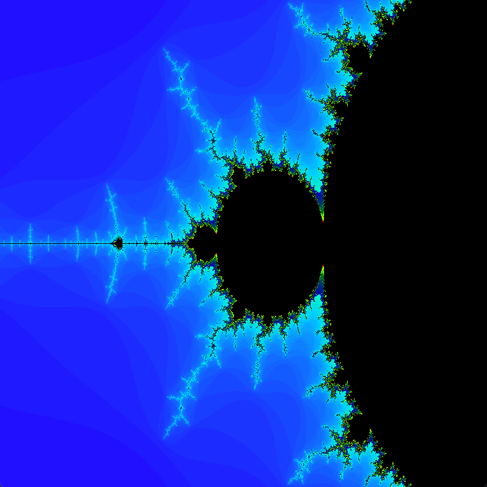

# Fractal Grapher

This project is a graphical fractal generator that displays several fractal types (Mandelbrot, Julia, Tricorn, Newton's) using the **SFML** library for rendering and **OpenGL** for 2D graphics. The project allows zooming in and out of the fractals and displays them in real-time using keyboard controls.

---
# The Fractals

  
 
  
  

## Features

- **Fractal Types**:
  - **Mandelbrot Set**: A famous fractal defined by the iteration of a complex quadratic polynomial.
  - **Julia Set**: A family of fractals defined by iterating a fixed complex constant.
  - **Tricorn Set**: Similar to the Mandelbrot set, but with the conjugate of the complex number.
  - **Newton's Fractal**: Based on the roots of a polynomial function (e.g., \( z^3 - 1 \)) using Newton's method.

- **Zooming**: Users can zoom in and out of the fractals dynamically by modifying the viewing window's boundaries.

- **Coloring**: The fractals are rendered using complementary-based coloring techniques, with various color gradients available (e.g., monochromatic pink, spectral colors).

---

## Installation

## 1. Clone the repository

## 2. Install Dependencies
1. Install SFML: 
    brew install sfml  # On macOS with Homebrew 
    sudo apt-get install libsfml-dev  # On Ubuntu/Debian.

## 3. Complile and run
    make
    ./main

## Controls
Use the arrow keys to navigate or left or right. 
Press w and s to zoom in and out.

## Known Issues
On some systems, the zoom feature may stop working.
This is due to the increasing number of iterations required for deeper zoom levels.

Additional fractals can be added in future versions to enhance the diversity of fractals rendered.

# License
This project is licensed under the MIT License - see the LICENSE file for details.